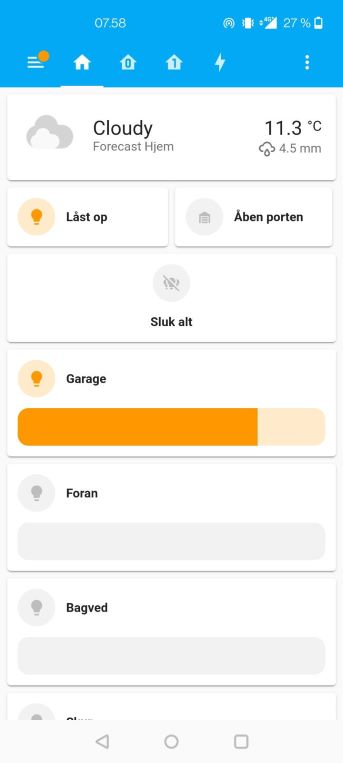

##Gavazzi SmartHouse integration in Home Assistant

##Introduction

This small project was motivated by my all frustrations with the webapp supplied by Gavazzi SmartHouse automation.
I choose to switch to Home Assistant, and have never looked back, it plays very well with the SmartHouse modbus, and gives very good performance, easy login, better UI, a lot of community support and modules. Best of all, you can still utilize all the SmartHouse automation.

##How it works

1. You just need to follow one of the many guides on the internet, showing you how to setup homeassistant.
2. Next you have to go into your SH-Tool, under modbus you have to activate all the components you want to expose.
3. You need to build the Home Assistant configuration.yaml based on the modus adresses. I have included my yaml under example (for niceness, some settings is moved to the smarthouse-lights.yaml)
    - Another option, besides building it manually, is to use this node.js project. 
      - In the SH-tools modbus you have the option to export a csv. 
      - Replace input.csv with this export and run build.js.
      - It will build 3 yaml files with all configuration needed. You will need to copy this manually into the configuration yaml, you could keep some data in separate configuration files, or just include all in configuration.yaml (see my yaml files under example)
4. Next you will be able to build your dashboard or automation using your SmartHouse modules.

##Need help?

I am in a lack of time, so this is not a thorough guide. Please let me know if people are interested in a more detailed guide. 
I will try to expand it if you tell me what problems you encounter. I do not want to spend time building it, if no one are going to use it.  